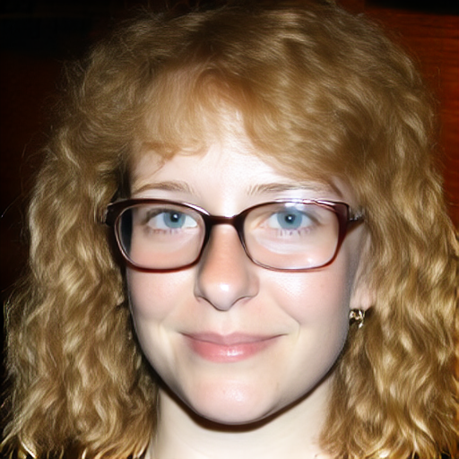
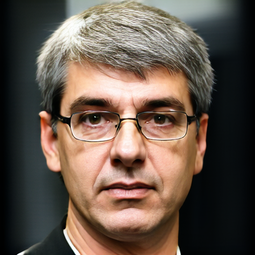
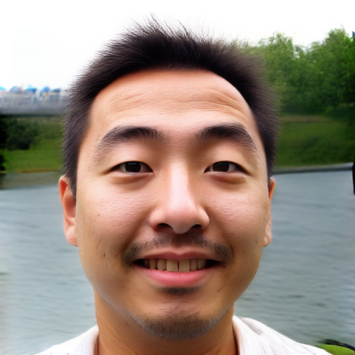
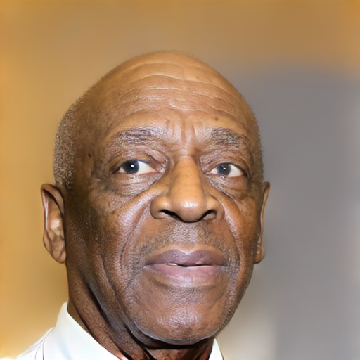
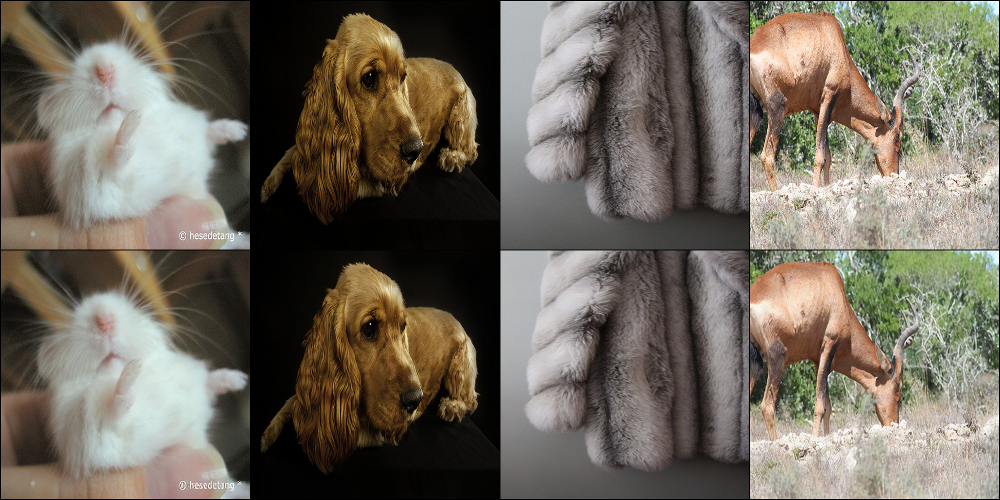
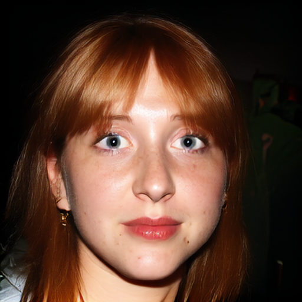
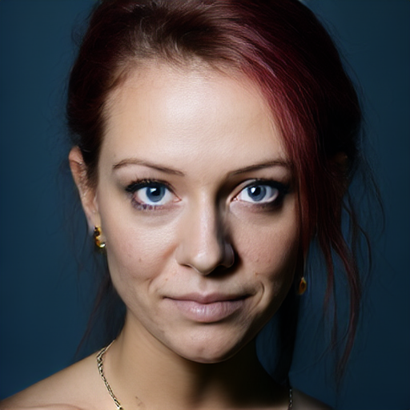
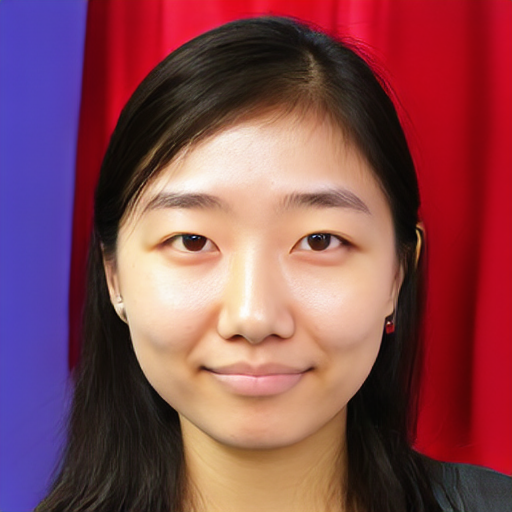
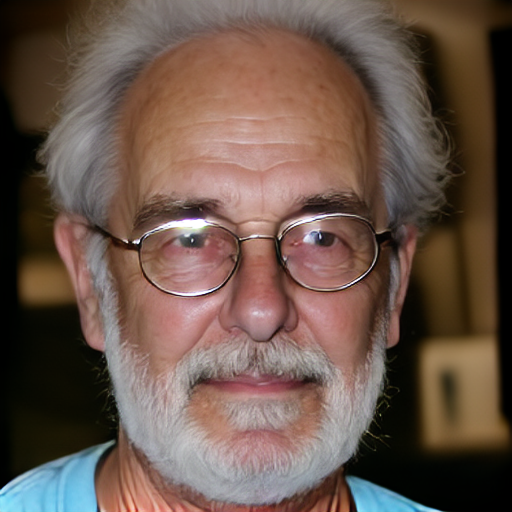

# MM-DiT From Scratch: High-Fidelity Diffusion Training on Limited Dataset


<div align="center">
  
  
  
  
</div>

<div align="center">
  <em>Samples generated from the trained MM-DiT model on the FFHQ dataset.</em>
  <br><br>
  <details>
    <summary><b>✨ Click to see generation prompts</b></summary>
    <div align="left" style="padding: 10px; font-size: 15px;">
      <p><b>Face 1:</b> <i>Photograph of a young woman with light brown voluminous curly hair and blue eyes. Subtle smile. She wears large, rectangular, brown-framed glasses. She has freckles. She wears small, gold hoop earrings, there is a wooden wall in the background. (negative:blurred image)</i></p>
      <p><b>Face 2:</b> <i>Middle-aged man. He has short grayish-brown hair with parted from left and eyes are a light brown color, he is looking directly at the camera with a neutral expression. He wears thin, rectangular glasses with a black frame. His lips are pursed. The background is dark gray. Lighting is even and soft, highlighting his facial features without creating harsh shadows. (negative:blurred image)</i></p>
      <p><b>Face 3:</b> <i>Middle-aged Asian man in front of an lake, he has short black hair, he is looking at the camera with happy expression, outdoor setting, natural lighting comes from front evenly. Overall mood is friendly. (negative:blurred image)</i></p>
      <p><b>Face 4:</b> <i>An elderly African American man with a bald head, looking aside, light brown eyes, slightly wrinkled face with visible age spots. His expression is neutral, lips are slightly parted. (negative:blurred image)</i></p>
    </div>
  </details>
</div>
<br/>

This project provides a practical approach to training a Multimodal Diffusion Transformer (MM-DiT) from scratch, leveraging a custom-trained VAE. By implementing specific memory and pipeline optimizations, it demonstrates how to build a foundational model dedicated to high-fidelity human face synthesis using only a single consumer-grade GPU, achieving impressive results with a remarkably efficient dataset of just 70,000 samples.

| Feature | Details |
|---|---|
| Architecture | MM-DiT (Multimodal Diffusion Transformer) |
| Text Encoder | T5-Base (768-dim) |
| VAE | Custom 8-channel, trained from scratch |
| Training Method | Rectified Flow Matching |
| Hardware Target | Single GPU|

## ⚡ Single-GPU Optimizations

To overcome the severe memory bottlenecks of a 16GB VRAM GPU, this project implements optimized, custom-built training pipeline:

* **Native BFloat16 (BF16) Mixed Precision**: The entire pipeline operates natively in `torch.bfloat16`. This halves VRAM consumption and maximizes Tensor Core throughput without sacrificing the numerical stability required during complex loss calculations.

* **Aggressive Gradient Checkpointing**: Trades computation time for a massive VRAM reduction. By recalculating intermediate activations during the backward pass rather than storing them, we can train significantly deeper Transformer blocks.

* **Micro-Batching & Gradient Accumulation**: Maintains a mathematically sound, large global batch size without triggering Out-Of-Memory (OOM) errors. 

* **Standard AdamW Optimizer**: For code clarity and training stability, the standard `torch.optim.AdamW` optimizer is used by default.
<br><br>
 *If you need additional VRAM savings, consider the following drop-in alternatives and techniques that are left to the user's discretion:*

  | Technique | Notes |
  |---|---|
  | **AdamW 8-bit** (`bitsandbytes`) | Drop-in replacement via `bnb.optim.AdamW8bit`. Minimal quality impact. |
  | **Adafactor Optimizer** | Stores only row/column statistics instead of full momentum tensors. |
  <br>

> 💡 **Tip**: You can toggle these memory-saving features off in `config.py`

## 📊 Trained Model & Training Details

* **Model Size**: ~260M Parameters (MM-DiT core).
* **Hardware**: Trained on a single NVIDIA RTX 4070 Ti SUPER.
* **Training Duration**: 150 epochs on 256px and 100 epochs on 512px.
* **Dataset**: FFHQ (Flickr-Faces-HQ).

## 🧠 Core Architecture

* **Custom MM-DiT Core**: A fully implemented Transformer-based diffusion model, heavily inspired by the SD3 architecture (Esser et al., 2024), built for scalable, high-resolution generation.

* **T5-Base Text Encoding**: Deep, context-aware prompt understanding utilizing the T5-base language model.

### Custom VAE (f8)

This project using a custom 8-channel VAE (~100M params) trained from scratch on ImageNet (1.3M) and CelebA.

<div align="center">
  
  <br/>
  <em>Top row: Original Images (Unseen data). Bottom row: 8-Channel VAE Reconstructions.</em>
</div>

## 🎨 Production-Ready Gradio UI

The repository isn't just about training; it includes a web interface for inference:
* **Dynamic Resolution Handling**: Seamlessly generate images across variable aspect ratios.
* **Batch Generation**: Support for simultaneous and sequential batch generation with seed control.

## 🧠 Pre-trained Models

| Model | Resolution | Dataset | Parameters | Link |
|---|---|---|---|---|
| NovaFace-DiT | 512×512 | FFHQ | ~260M | [Hugging Face](https://huggingface.co/devbnamdar/NovaFace-DiT) |
| Nova_ae_f8 | up to 1024px | ImageNet + CelebA | ~100M | [Hugging Face](https://huggingface.co/devbnamdar/Nova_ae_f8) |

## 📁 Project Structure

```
├── config.py              # All hyperparameters and dataset paths
├── mm_dit.py              # MM-DiT model architecture (Transformer + AdaLN)
├── vae.py                 # Custom 8-channel VAE architecture
├── train.py               # Main training loop (Flow Matching)
├── dataset.py             # Dataset loaders (Tar + Folder + SQLite captions)
├── ar_bucketing.py        # Aspect Ratio bucketing logic
├── run_ar_bucketing.py    # AR bucket generation helper script
├── resize_model.py        # Positional embedding resize for resolution scaling
├── gradio_ui/app.py       # Gradio inference interface
├── vae_models/            # Place VAE weights here
└── assets/                # Sample images for README
```
<br><br>

<div align="center">
  
  
  
  
</div>

<br/>

## 🚀 Getting Started & Configuration

### 1. Installation
```bash
git clone https://github.com/devbnamdar/MM-DiT-From-Scratch.git
cd MM-DiT-From-Scratch
pip install -r requirements.txt
```
*(Ensure your PyTorch version matches your CUDA environment).*

### 2. Configuration (`config.py`)
All dataset paths, model architectures, and training hyperparameters are centrally managed in `config.py`.

**Step 2.1: Setup the Custom VAE**
Download the pre-trained custom 8-channel VAE from the [Pre-trained Models](#-pre-trained-models) section and specify its path in `config.py`:
```python
vae_path = "vae_models/Nova_ae_f8.pth"
```

**Step 2.2: Define Datasets**
Next, map your dataset sources and JSONL caption files:
```python
datasets = [
    {
        # Use 'images_dir' for standard folders or 'tar_dir' for WebDataset archives
        "tar_dir": "/path/to/yourDataset",
        "caption_jsonl": "/path/to/captions/yourDataset_captions.jsonl"
    }
]
```

**Caption JSONL Format (`.jsonl`):**
To ensure the custom high-speed SQLite dataloader maps text correctly, your caption files must be formatted with `file_name`, `type`, and `text` keys per line:
```json
{"file_name": "image_001.jpg", "type": "long", "text": "A highly detailed portrait of..."}
{"file_name": "image_001.jpg", "type": "medium", "text": "A dog playing in the park."}
{"file_name": "image_001.jpg", "type": "short", "text": "A portrait."}
{"file_name": "image_002.jpg", "type": "long", "text": "Cute cat sitting on a bench."}
```
*(Note: The system automatically picks a random caption type among 'long', 'medium', or 'short' during training to improve text-alignment robustness + You don't need to have all types of captions. If you want only one caption per image, simply select any type from {long, med, short}.).*

**T5 Tokenizer Length (`mm_dit.py`):**
To balance memory efficiency and text understanding, the maximum text token length is set to `128` inside `mm_dit.py` (`T5Embedder` class). This length is generally optimal for detailed captions and saves VRAM. However, you can manually increase or decrease this `max_length` value directly in the code depending on your specific needs.

### 3. Aspect Ratio (AR) Bucketing (Optional)
If you want to train efficiently on different aspect ratio images and prevent wasteful zero-padding, use the built-in AR bucketing feature:

1. Generate the bucket mappings by running:
```bash
python run_ar_bucketing.py
```
*(This will scan your datasets and generate an `ar_buckets.json` file).* 
<br>
Set `use_ar_bucketing = True` in your `config.py`.

### 4. Start Training
Once your parameters are ready, launch the training process:
```bash
python train.py
```

**Advanced Training Arguments (CLI):**
To make the training process highly practical and robust against interruptions, you can use the following arguments:
* `--resume-from-checkpoint "latest"`: Automatically finds the most recent checkpoint and resumes the exact training state (including optimizer momentum and the precise number of images seen). You can also pass a specific checkpoint path.
* `--force-lr 1e-5`: When resuming from a checkpoint, the old learning rate is reloaded from the optimizer state. This argument allows you to forcefully override the learning rate (useful for manual LR decay in later stages).

**Example (Resuming a run with a lower learning rate):**
```bash
python train.py --resume-from-checkpoint "latest" --force-lr 1e-5
```

**📊 Monitoring Training with TensorBoard:**

The training script automatically logs loss metrics, gradient norms, and epochs. To visually track your model's convergence and stability in real-time, open a new terminal and run:
```bash
tensorboard --logdir=diffusion_outputs_512/logs
```
*(Then open the provided `http://localhost:6006` link in your web browser).*

### 5. Resolution Scaling (Optional)
To upscale a model trained at a lower resolution (e.g., 256px) to a higher one (e.g., 512px), use the positional embedding resize tool:
```bash
python resize_model.py --input_file pathToYour/checkpoints/model.safetensors --output_file anotherOutputDir/resized_model.safetensors --old_size 256 --new_size 512
```
> **Note**: After resizing, update `image_size` in `config.py` and resume training with the resized weights on another output folder. Do **not** load the old `optimizer.bin` — the optimizer state is incompatible after resizing.

### 6. Launch Inference UI
To test your trained model or evaluate checkpoints via the advanced Gradio interface:
```bash
python gradio_ui/app.py
```


## 📝 License

> ⚠️ **License Disclaimer**: 
> * **Source Code**: [**MIT License**](LICENSE).
> * **MM-DiT Core**: Trained on the FFHQ dataset. Model weights are licensed under [**Creative Commons BY-NC-SA 4.0**](https://creativecommons.org/licenses/by-nc-sa/4.0/) (Non-commercial).
> * **Custom VAE**: Trained on ImageNet/CelebA. Subject to [**CC BY-NC 4.0**](https://creativecommons.org/licenses/by-nc/4.0/) (Non-commercial).

## 📄 Citation
If you find this work useful, please consider citing:
```bibtex
@misc{namdar2026mmdit,
  author       = {Namdar, Bunyamin},
  title        = {MM-DiT From Scratch: High-Fidelity Diffusion Training on Limited Dataset},
  year         = {2026},
  publisher    = {GitHub},
  url          = {https://github.com/devbnamdar/MM-DiT-From-Scratch}
}
```

## 🙏 Acknowledgements
* **Architecture**: Special thanks to the authors of the **Stable Diffusion 3 (SD3)** paper: [*Scaling Rectified Flow Transformers for High-Resolution Image Synthesis*](https://arxiv.org/abs/2403.03206) (Esser et al., 2024). The MM-DiT architecture implemented in this repository was heavily inspired by their groundbreaking research and methodologies.
* **Dataset**: [FFHQ](https://github.com/NVlabs/ffhq-dataset) (Karras et al., 2019).
## 💬 Contact & Community

If you have any questions, suggestions feel free to reach out!
* **Email:** [bunyaminnamdar123@gmail.com](mailto:bunyaminnamdar123@gmail.com)

For technical issues, bug reports, or feature requests, please open an [Issue](https://github.com/devbnamdar/MM-DiT-From-Scratch/issues) on GitHub. Contributions are always welcome!

---
*Created by [Bünyamin NAMDAR]*
